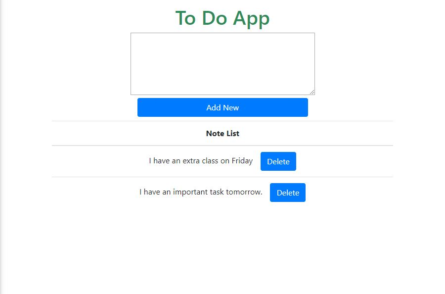

This project was bootstrapped with [Create React App](https://github.com/facebook/create-react-app).

Clone this repository 
cd timer-app 
run npm install (to download react packages) 
run npm install bootstrap --save 
run npm start (to start this project locally) 

then go to your browser and browse 'http://localhost:3000/' 
[<b>Note:</b> This will connect with my firebase realtime database, you need to change configuration, config in 'index.js' file, so change it your own config data]

You will see like this.
